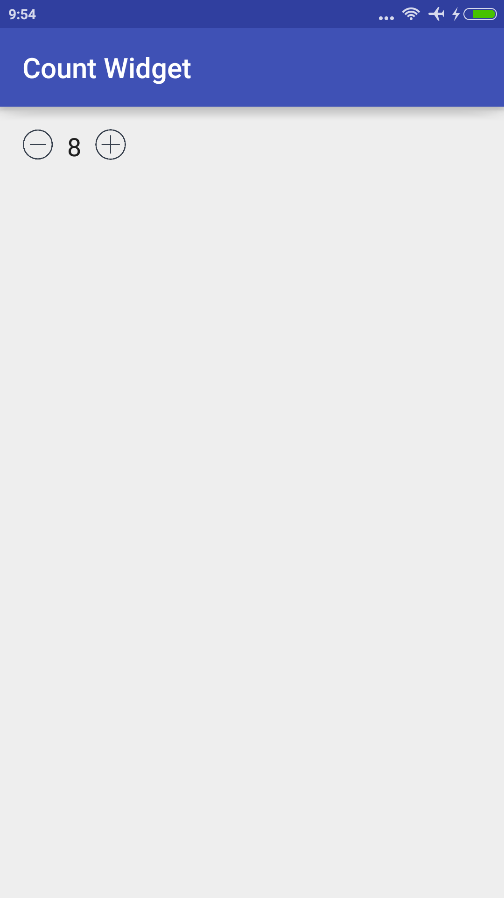

Counter Widget
==============

The widget have two buttons, left to decrement the count and right to increment. And there is an edit text view
which shows the count value.




```xml
<?xml version="1.0" encoding="utf-8"?>
<LinearLayout xmlns:android="http://schemas.android.com/apk/res/android"
    xmlns:tools="http://schemas.android.com/tools"
    xmlns:custom="http://schemas.android.com/apk/res-auto"
    android:orientation="vertical"
    android:layout_width="match_parent"
    android:layout_height="match_parent"
    android:paddingBottom="@dimen/activity_vertical_margin"
    android:paddingLeft="@dimen/activity_horizontal_margin"
    android:paddingRight="@dimen/activity_horizontal_margin"
    android:paddingTop="@dimen/activity_vertical_margin"
    tools:context="com.restroshop.countwidget.MainActivity">

    <com.restroshop.components.CountWidget
        android:id="@+id/counter1"
        android:layout_width="wrap_content"
        android:layout_height="wrap_content"
        custom:max="15"
        custom:min="5"
        android:paddingBottom="10dp" />
</LinearLayout>
```

Attribute **max** and **min** are maximum and minimum value that the counter can take.
